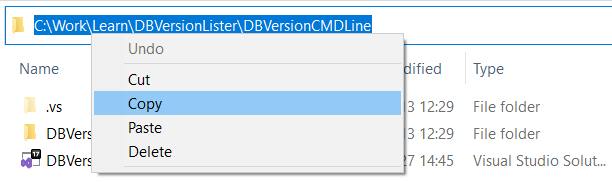
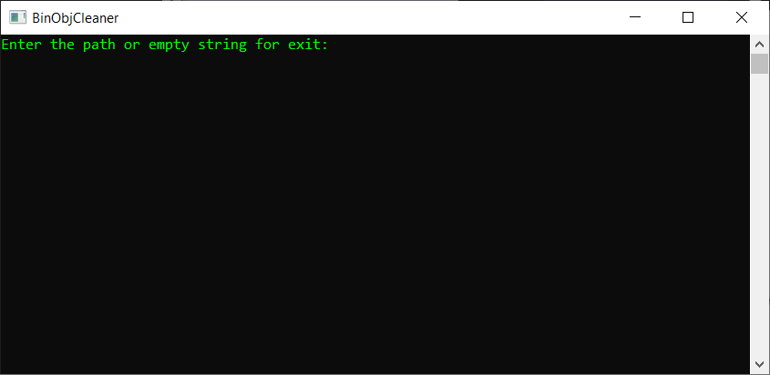
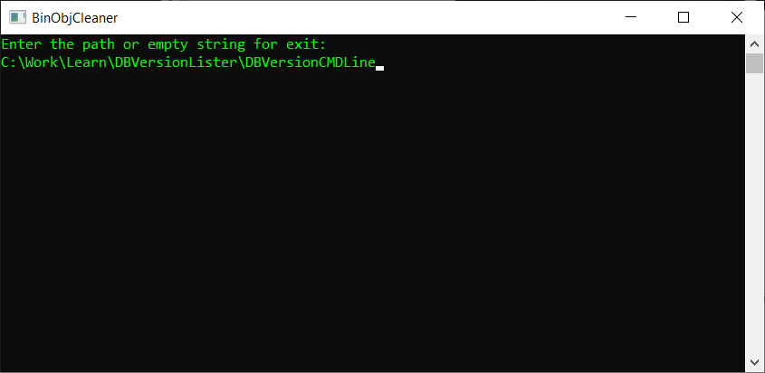
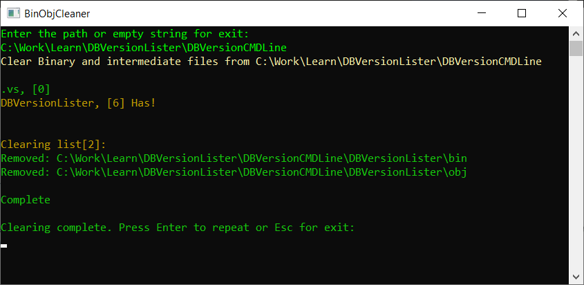

# Binary Objects Cleaner

## How to use
- Copy the path to your solution root folder to the clipboard. 

- Start the BinObjCleaner.exe 

- Paste the path. 

- Press Enter. 

- Enjoy.

### Note.
It is recommended in the case of big projects to close Visual Studio before cleaning because IDE tries to do some prebuild immediately and can fall into an inconsistent state.
